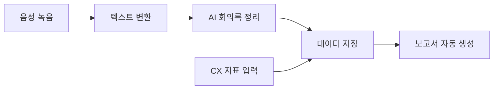

# CX 회의록 & 보고서 자동화 도구

CX팀의 회의 내용을 AI로 자동 정리하고, 축적된 데이터를 기반으로 주간/월간 보고서를 자동 생성하는 웹 앱입니다.

## 주요 기능

- **음성 녹음 & 텍스트 변환**: 브라우저에서 직접 회의를 녹음하고 실시간으로 텍스트로 변환
- **AI 회의록 자동 정리**: 안건별 논의 내용, 결정사항, 액션 아이템을 자동 분류
- **주간 보고서 자동 생성**: 회의록 + CX 지표 데이터를 조합해 보고서 초안 자동 생성
- **CX 지표 관리**: 문의 건수, 처리 현황, 주요 이슈 입력 및 추적

## 기술 스택

| 영역 | 기술 |
|------|------|
| 프론트엔드 | HTML + Tailwind CSS + Vanilla JS |
| AI 연동 | OpenAI API / Claude API |
| 음성 인식 | Web Speech API |
| 데이터 저장 | IndexedDB |
| 배포 | GitHub Pages |

## 아키텍처

프로젝트의 상세 아키텍처는 [architecture.md](./architecture.md)를 참고하세요.

## 프로젝트 문서

| 문서 | 설명 |
|------|------|
| [PRD.md](./PRD.md) | 제품 요구사항 문서 |
| [ideation.md](./ideation.md) | 아이디어 브레인스토밍 문서 |
| [architecture.md](./architecture.md) | 시스템 아키텍처 다이어그램 |
| [development-plan.md](./development-plan.md) | 개발 계획 및 작업 목록 |
| [mockup.html](./mockup.html) | 동작하는 UI 목업 |

## 시작하기

1. `mockup.html`을 브라우저에서 열어 목업을 확인하세요
2. GitHub Issues에서 개발 작업 목록을 확인하세요
3. 개발 계획에 따라 순서대로 구현하세요

## 만든 이: 바이브 코딩 워크숍

이 프로젝트는 **비개발자를 위한 바이브 코딩 워크숍**에서 AI(클로드)와 자연어 대화로 만들어졌습니다.
