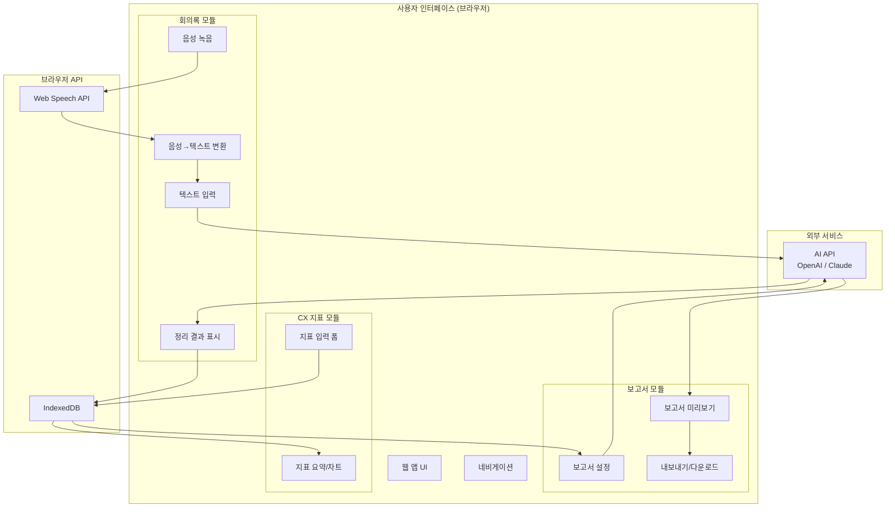
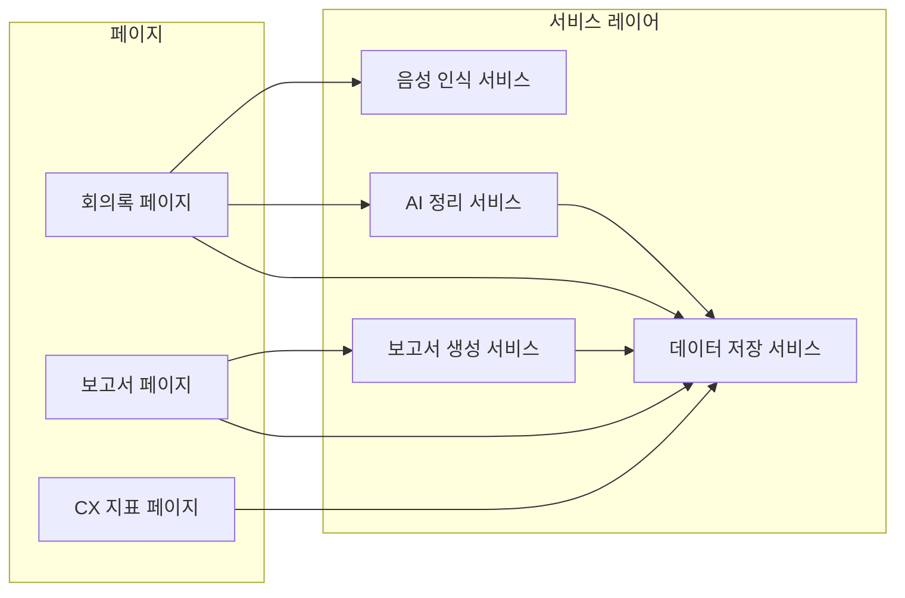
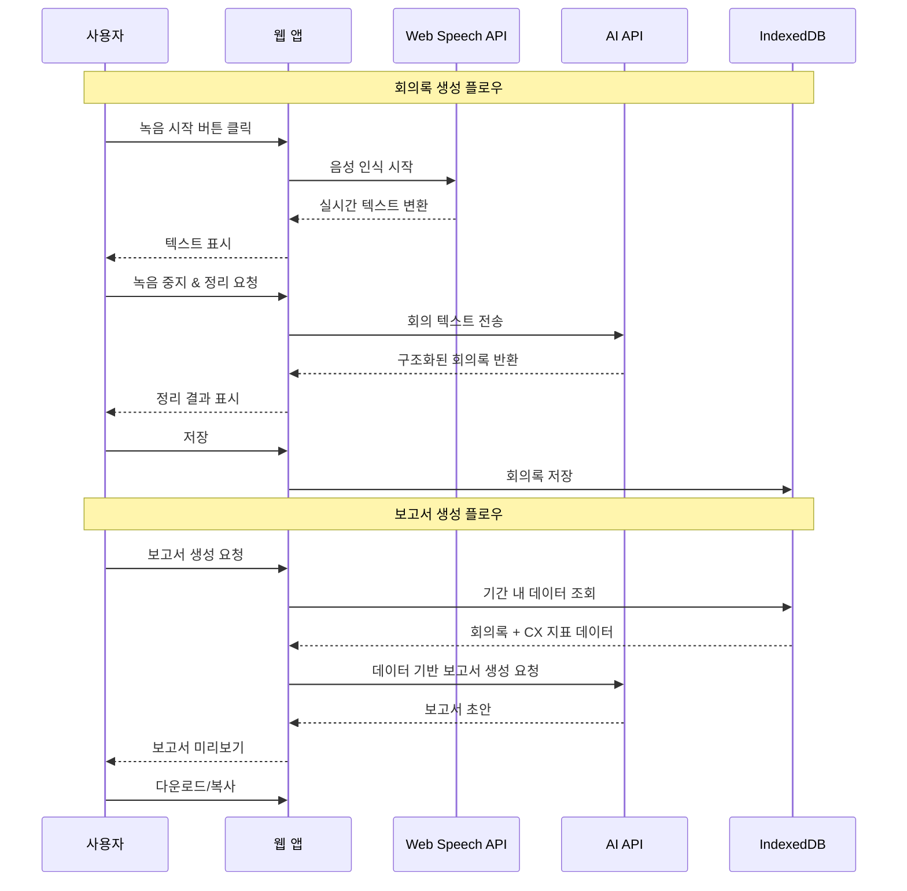
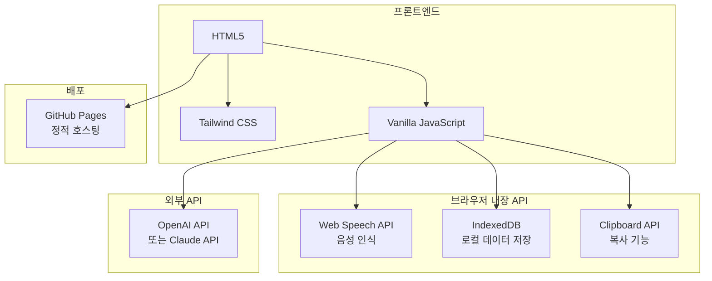

# 아키텍처 문서: CX 회의록 & 보고서 자동화 도구

## 시스템 전체 구조



## 주요 컴포넌트 간 관계



## 데이터 흐름



## 기술 스택 요약



## 파일 구조

```
my-vibe-project/
├── index.html          # 메인 앱 (단일 HTML 파일)
├── README.md           # 프로젝트 소개
├── PRD.md              # 제품 요구사항 문서
├── ideation.md         # 아이디어 문서
├── architecture.md     # 아키텍처 문서 (이 파일)
├── development-plan.md # 개발 계획
├── mockup.html         # UI 목업
└── docs/
    ├── tutorial.md     # 바이브 코딩 튜토리얼
    └── git-manual.md   # 비개발자용 Git 매뉴얼
```
